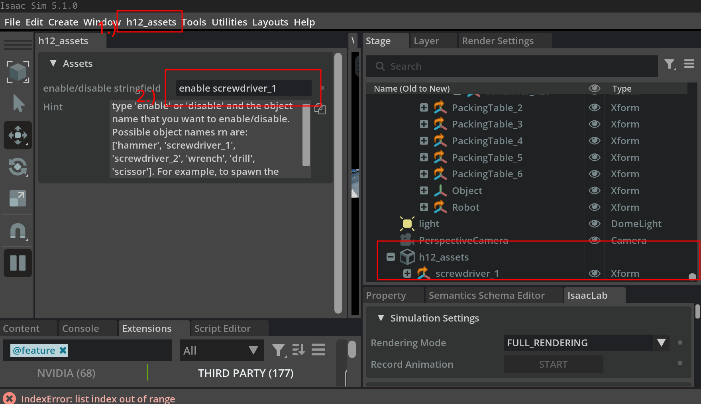

# H12 Sim Extensions

Isaac Sim extensions for full ROS2 stack simulation of Unitree H1-2 inside Isaac Sim.

## Installation
TODO: Make this lol
```bash
# Add installation instructions here
```

<!-- ## Quick Start -->
<!-- ```javascript -->
<!-- // Add a quick example here -->
<!-- ``` -->

## Features

- Experiment Assets(currently being worked on)
- Camera stuff(currently being worked on)
- Lidar stuff(not started yet)

## Documentation

### H12_Assets

Assets for H1-2 grasp experiments. I will add asset download docs later.
In order to use in sim, simply enable the extension and say what assets you would like to spawn/despawn.
Please see the image for how to do it, also, there's a hint text box that also gives detailed instructions + the current objects that can be spawned in.

TODO: Add spawn locations on a table or smth.

### H12_Camera

ROS2 topics/omnigraphs for the cameras on the robot. Currently workign on this. idk.
TODO: do ot

<!--  -->

<!-- ### Extension Name 3 -->

<!-- Description and usage examples go here. -->
<!---->
<!--  -->
<!---->
<!-- ### Extension Name 4 -->
<!---->
<!-- Description and usage examples go here. -->
<!---->
<!--  -->
<!---->
<!-- ### Extension Name 5 -->
<!---->
<!-- Description and usage examples go here. -->
<!---->
<!--  -->
<!---->
<!-- ## Contributing -->
<!---->
<!-- Guidelines for contributing to the project. -->
<!---->
<!-- ## License -->
<!---->
<!-- License information goes here. -->
